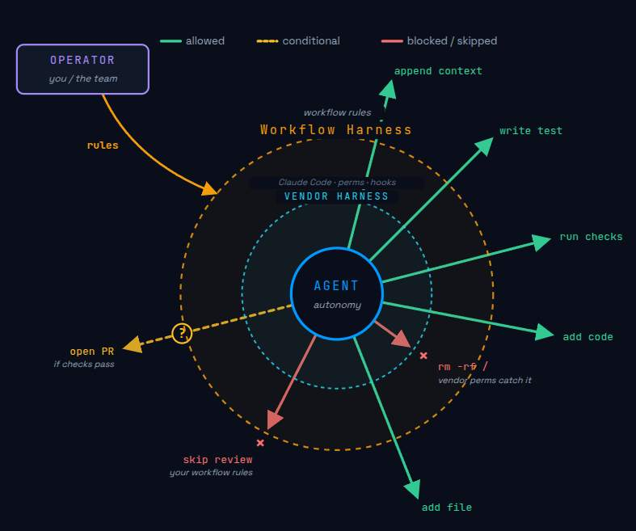
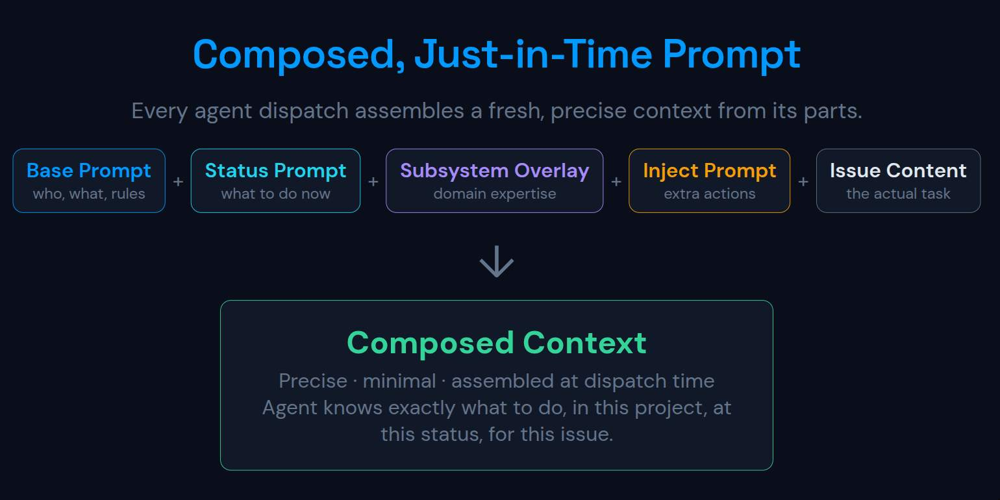

# Markdown Workflow Engine

A **workflow harness for AI coding agents**. You describe how work should flow — statuses, transitions, validation gates, human-approval checkpoints, side-effects — in a single `workflow.yaml`. Agents (Claude, Codex, Cursor) drive issues through that contract from the CLI. Humans observe, override, and approve from a kanban-style web UI.

Issues are markdown. Workflow is YAML. Everything is on disk — no API keys, no SDKs, no database.

## Why a harness?



AI coding agents are great at writing code and terrible at knowing when to stop, what to verify, and when to hand off to a human. Left alone they'll mark anything "done."

A workflow harness gives them a contract:

- A status lifecycle they must walk one step at a time (`idea → in design → backlog → in progress → testing → …`).
- Validation rules at each transition (body has a Design section, all Test Plan checkboxes ticked, linked PR is merged, an arbitrary shell command exits 0).
- Human approval gates at the points that matter (`backlog → in progress`, `shipping → done`).
- Side-effects that happen automatically (clear assignee on backlog, inject extra prompt context, append a checklist scaffold).
- Per-system overlays so the API, CLI, and UI parts of your project can have their own design prompts and extra rules without forking the whole workflow.

### Vendor harness vs. workflow harness

**Vendor harness → sandbox.** Global rules covering what the agent can and can't do across every project. A lock-in — hooks, skills, and settings shape are vendor-specific.

**Workflow harness → "what good looks like."** Per-project, per-work-type. Refines behavior. Portable — take it with you when you swap vendors. The same workflow runs on both Codex and Claude.

## How to use it (in 5 steps)

1. **Try the demo.** A sample project with issues, docs, and a configured workflow.

   ```bash
   make demo
   # open http://localhost:8080
   ```

2. **Define your workflow** in `workflow.yaml` — statuses, transitions, validators, approval gates. See the example below.
3. **Write (or sync) issues** as markdown files in `./issues/` with YAML frontmatter (`title`, `status`, `system`, …).
4. **Start the web UI** so humans can watch and approve:

   ```bash
   go build && ./issue-viewer -dir ./issues -docs ./docs
   ```

5. **Point an agent at it.** Install the CLI with `make install`, then let the agent run `issue-cli process` to learn the contract and `issue-cli next` → `start` → `transition` → `done` to walk an issue through.

## What it looks like

A minimal `workflow.yaml`:

```yaml
statuses:
  - name: "idea"
    prompt: |
      Clarify scope with the human before proposing a design.
  - name: "in design"
    prompt: |
      Turn the idea into checklists, assumptions, and open questions.
  - name: "backlog"
    description: "Ready to work on"
    side_effects: [clear_assignee]
  - name: "in progress"
  - name: "testing"
  - name: "done"

transitions:
  - from: "idea"
    to: "in design"
    actions:
      - type: validate
        rule: body_not_empty
      - type: append_section
        title: "Design"
        body: |
          - [ ] Approach
          - [ ] Edge cases
          - [ ] Test plan

  - from: "backlog"
    to: "in progress"
    actions:
      - type: require_human_approval
        status: "in progress"

  - from: "testing"
    to: "done"
    actions:
      - type: validate
        rule: section_checkboxes_checked
        section: "Test Plan"
      - type: validate
        rule: command_succeeds
        command: "go test ./..."
```

That's the whole contract. Validators, approval gates, prompt injection, scoring, system overlays, optional parking states — all live here. See [docs/workflow.md](docs/workflow.md) and [docs/Workflow/overview.md](docs/Workflow/overview.md) for the full schema.

## The pieces

### Workflow engine

- **Configurable lifecycle** — statuses, descriptions, prompts, board column order, all in `workflow.yaml`.
- **Strict transitions** — agents move one step at a time; humans can drag-and-drop in the UI to bypass.
- **Validation library** — `body_not_empty`, `has_section`, `section_min_length`, `section_checkboxes_checked`, `field_in`, `field_matches`, `has_label`, `has_pr_url`, `linked_issue_in_status`, `no_todo_markers`, `command_succeeds` (opt-in shell), and more. Each failure returns a hint with the exact `issue-cli` command to fix it.
- **Approval gates** — `require_human_approval` blocks a transition until a human ticks a box in the web UI. The CLI surfaces a deep link to that box on failure.
- **Side-effects** — auto-clear assignee, append section scaffolds, set frontmatter fields, inject prompt context.
- **Optional statuses** — parking states (`waiting-for-team-input`) that are skippable on the happy path but available as a CTA when needed.
- **System overlays** — per-system status prompts and extra transition actions for project subsystems (API, CLI, UI, …).
- **Scoring** — opt-in priority/urgency/staleness scoring that ranks issues across the list and board views.

### Just-in-time prompts



Agents don't get a giant system prompt up front. Instead, the harness assembles a prompt **on demand** from pieces that live next to the work:

- The current status's `prompt` from `workflow.yaml` (what to focus on right now).
- The next transition's `Requires:` / `Will:` block (the gates and side-effects ahead).
- Any per-system overlay for the issue's `system` field (API/CLI/UI-specific guidance).
- The issue body, comments, checklists, and sidecar data fetched fresh from disk.

The agent calls `issue-cli context <slug>` and `issue-cli process` to pull exactly the slice it needs for the step it's on — no stale context, no prompt drift.

### CLI (`issue-cli`)

Bot-friendly. Walks an agent through the workflow without it having to read this README.

```bash
issue-cli process              # learn the project's workflow (run first)
issue-cli next --version 0.2   # find work for a version
issue-cli start <slug>         # claim + transition to in-progress
issue-cli context <slug>       # full body, comments, checklist
issue-cli transition <slug>    # one step forward
issue-cli done <slug>          # only valid from documentation status
```

`process` prints the live workflow contract — statuses, prompts, transitions, validators, side-effects — so an agent can read it directly without any external doc. Every transition prints a `Requires:` / `Will:` block so agents know the gates *before* hitting them.

Other useful subcommands: `create`, `claim`, `unclaim`, `comment`, `check`, `checklist`, `append`, `replace`, `list`, `search`, `stats`, `data`. Full reference in [docs/CLI/overview.md](docs/CLI/overview.md).

### Web UI

The human window into the workflow.

- **Kanban board** with drag-and-drop, version/system/assignee filters, score badges, active-agent indicators on each card.
- **List view** with filters and score-sortable columns.
- **Detail view** with inline frontmatter editing, body editing in `nvim`, transition preview, approval checkboxes, score breakdown.
- **Inline data tables** — `<!-- data statuses=open,resolved -->` renders an editable triage table backed by a sidecar JSON. Designed for code-review findings.
- **Inline comments** on body blocks, with open/done status, stored at the bottom of each markdown file in an HTML comment block (invisible to other renderers).
- **Docs viewer** with folder tree, for the project's own documentation.
- **Workflow designer** and **stats** tabs for inspecting the workflow contract and per-status token-cost estimates.
- **Themes** — dark, dracula, light.

### Agent dispatch

- Send an issue to Claude or Codex from the board (hover, click ▶) or detail page.
- Agents run in `tmux` sessions inside `alacritty` windows tiled by `i3`. Sessions named after issue slugs surface as live activity badges in the UI.
- Granting human approval from the detail page can notify the running tmux session so the agent picks up immediately.

See [docs/agent-dispatch.md](docs/agent-dispatch.md) and [docs/agent-workflow-flow.md](docs/agent-workflow-flow.md).

### Multi-project

`projects.yaml` lets one server host several independent projects, each with its own issues, docs, and workflow.

```yaml
projects:
  - name: "Combat System"
    slug: "combat"
    issues: "./combat/issues"
    docs: "./combat/docs"
    version: "0.3"
  - name: "Renderer"
    slug: "renderer"
    issues: "./renderer/issues"
    docs: "./renderer/docs"
```

```bash
./issue-viewer -config projects.yaml
```

### GitHub sync (optional)

```bash
./sync-issues.sh <owner> <project-number> ./issues
```

Pulls items from a GitHub Project into `issues/<System>/<number>.md`. The workflow runs on those imports the same as on hand-authored issues.

## Quick start

```bash
go build
./issue-viewer -dir ./issues -docs ./docs
# http://localhost:8080
```

Install the CLI:

```bash
make install
```

Validate before changes:

```bash
make validate   # vet + tests + cmd/issue-cli coverage gate
```

## Issue file format

```markdown
---
title: "Fix heat calculation"
status: "in progress"
system: "Combat"
version: "0.3"
priority: "high"
labels: [bug, combat]
---

Description in markdown. Supports tables, `[x]` checkboxes, and `#123` issue references.
```

| Field                | Description                                     |
|:---------------------|:------------------------------------------------|
| `title`              | Required.                                       |
| `status`             | One of the statuses in `workflow.yaml`.         |
| `system`             | Category tag; also used as a subdirectory name. |
| `version`            | String; filterable on board and `next`/`list`.  |
| `priority`           | `low` / `medium` / `high` / `critical`.         |
| `labels`             | List of strings.                                |
| `assignee`           | Free-text; agents default to `agent-<slug>`.    |
| `created`            | Sort key; auto-set on creation.                 |
| `score_boost`, `due` | Participate in scoring if enabled.              |

Any other key becomes a custom sidebar field. URLs render as links, lists render as bullets.

## Docs page format

```markdown
---
title: "Page Title"
order: 1
---

Content here.
```

Frontmatter optional; subdirectories become sections in the sidebar.

## Server flags

| Flag      | Default    | Description                                |
|:----------|:-----------|:-------------------------------------------|
| `-config` | —          | Path to `projects.yaml` (multi-project).   |
| `-dir`    | `./issues` | Issues directory (single-project mode).    |
| `-docs`   | `./docs`   | Docs directory (single-project mode).      |
| `-port`   | `8080`     | HTTP port.                                 |

## Where to read next

- [Workflow](docs/workflow.md) — lifecycle, prompts, validators, side-effects, scoring, overlays.
- [Workflow Overview](docs/Workflow/overview.md) — engine internals and YAML schema.
- [Agent Workflow Flow](docs/agent-workflow-flow.md) — full dispatch-to-done flow.
- [CLI Overview](docs/CLI/overview.md) — every subcommand and its output contract.
- [Agent Dispatch](docs/agent-dispatch.md) — terminal config and approval notifications.
- [Per-issue Data Store](docs/data-store.md) — sidecar JSON and inline triage tables.
- [Workflow Stats](docs/workflow-stats.md) — `/stats` tab and token-cost estimation.
