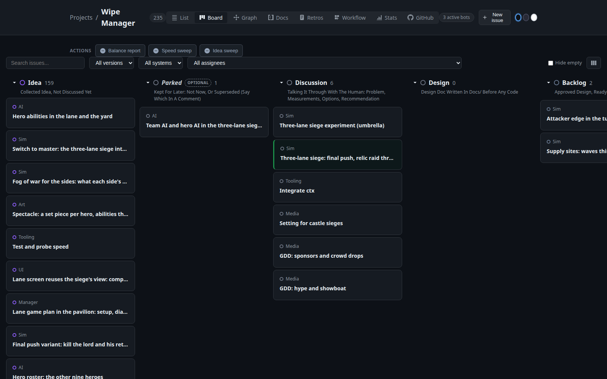
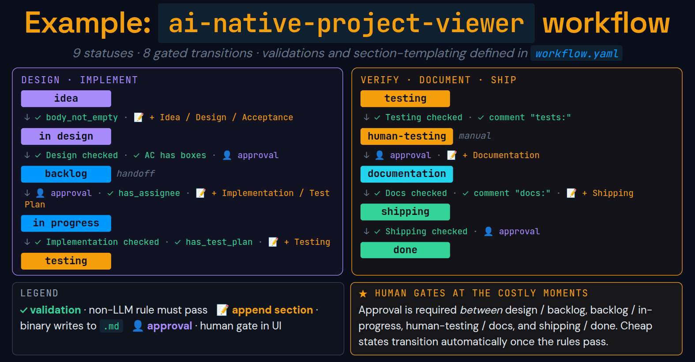
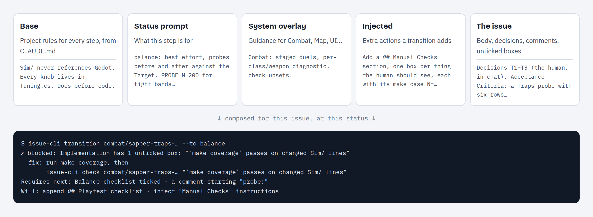
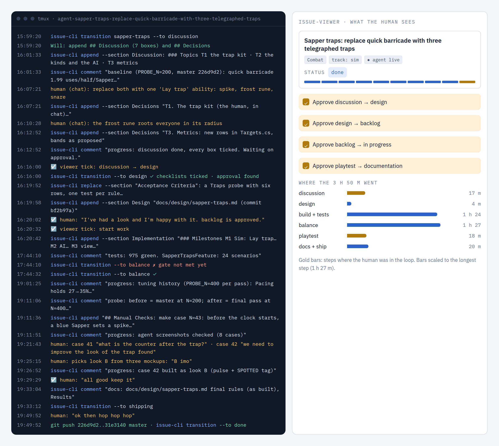
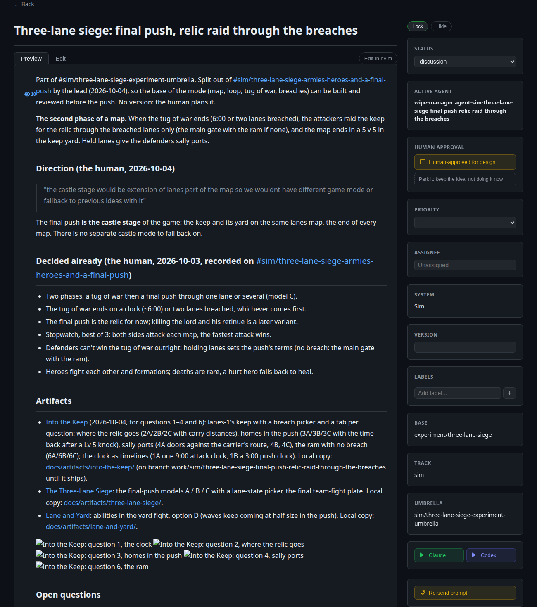
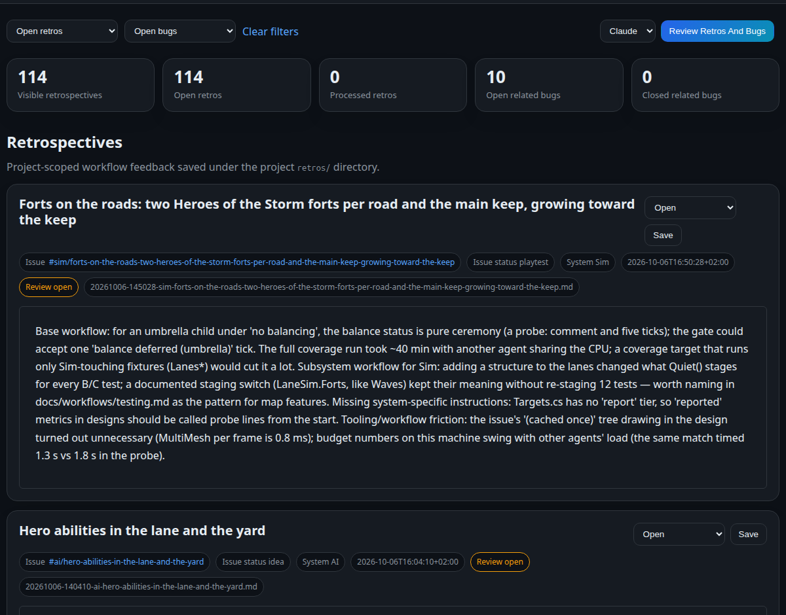
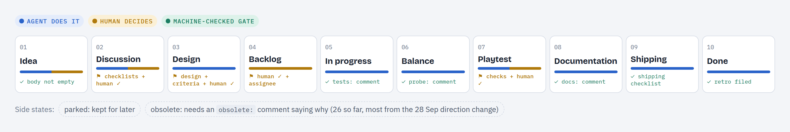
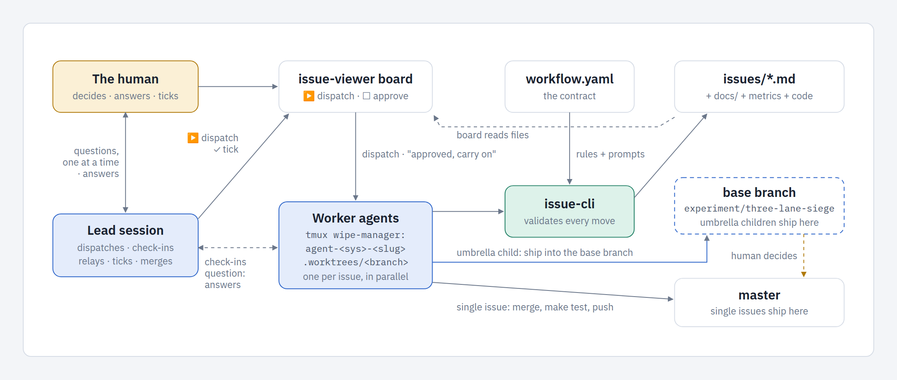
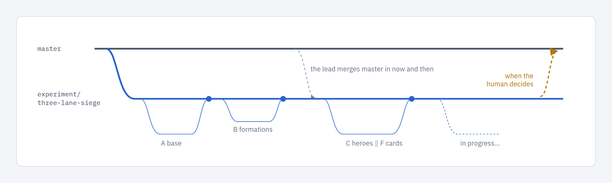

# AI Workflow Engine

**Run AI coding agents through a process you define, and approve the moments that matter.**

Issues are markdown files in your repo. The process is one `workflow.yaml`. Claude Code or Codex agents walk each issue through it with `issue-cli`, which won't let them skip a step, and you watch, steer and approve from a local web board.

Built for developers who already run Claude Code or Codex on their own repositories. Bundled templates also cover review queues and long-form writing.

<!-- Hero GIF slot (docs/images/hero.gif, not recorded yet): hover a card, press ▶ Claude; the agent's tmux pane runs `issue-cli start`; it blocks on a human approval; tick it on the issue page; the agent carries on and the card moves. 20–30 s, 1280×720, under 5 MB. Until then the board screenshot is the hero. -->


[Quickstart](#quickstart) · [How it works](#how-it-works) · [An issue's life](#an-issues-life) · [Configuration](#configuration) · [Commands](#commands) · [Docs](docs/)

## Why

Coding agents are good at writing code and bad at knowing when to stop. Left alone they skip the design, call untested work done, and ask you at the wrong moment or not at all.

AI Workflow Engine puts a contract around them:

- **One step at a time.** An agent moves an issue forward only when that step's checks pass: a section written, its checkboxes ticked, a `tests:` comment posted, a shell command green.
- **You own the costly moments.** Gates such as `backlog → in progress` wait for your tick on the board. The agent asks in chat, blocks with `--wait`, and carries on as soon as you approve.
- **Guidance arrives just in time.** Each status has its own prompt, and every failed check prints the command that fixes it. There is no giant system prompt to drift from.
- **Everything is files.** Markdown issues, a YAML workflow, git history as the audit log. No database, no SaaS, no API keys. The same workflow runs with Claude Code and Codex.

The longer argument, vendor harness vs. workflow harness: [docs/why.md](docs/why.md).

## Quickstart

You need Linux or macOS. To dispatch agents you also need `tmux`, `git`, and the `claude` or `codex` CLI on your `PATH`.

```bash
# 1. Install issue-viewer (the board) and issue-cli (the agent CLI) into ~/.local/bin
curl -fsSL https://raw.githubusercontent.com/michal-franc/ai-workflow-engine/main/install.sh | bash

# 2. In your repo: write workflow.yaml and create issues/ and docs/
cd my-project
issue-cli init --template development     # or: review, writing

# 3. Capture a first issue
issue-cli create --title "Add a dark mode toggle" --system UI
```

Tell the board where things live with a `projects.yaml` in the same folder:

```yaml
projects:
  - name: "My Project"
    slug: "my-project"
    issues: "./issues"
    docs: "./docs"
    workdir: "."
    terminal: "none"   # print the tmux attach command instead of opening a window
```

```bash
# 4. Open the board on http://localhost:8080
issue-viewer -config projects.yaml
```

Hover the card, press ▶ and pick **Claude**. The agent starts in a tmux session (`tmux attach -t agent-<slug>`), reads the workflow with `issue-cli process`, works the issue, and stops at the first gate for you. [check]

Just looking? Clone the repo and run `make demo` (Go 1.23+) to open a sample project. Other install options (a pinned version, manual download, building from source) are in [docs/getting-started.md](docs/getting-started.md).

## How it works



| Piece | What it is |
|---|---|
| **Issues** | One markdown file per issue, `issues/<System>/<slug>.md`. Frontmatter holds `title`, `status`, `system`, `version`, `priority`, `labels`, `assignee` and any custom key. The body grows section by section; comments sit in a hidden block at the end of the file. See [docs/issue-format.md](docs/issue-format.md). |
| **Workflow** | `workflow.yaml`: statuses with a prompt each, transitions with ordered actions (`validate`, `require_human_approval`, `append_section`, `inject_prompt`, `set_fields`), optional side states, and per-system overlays. |
| **issue-cli** | How agents (and you) move issues: `start`, `check`, `comment`, `transition`. It enforces the workflow and prints `Requires:` / `Will:` before every step. |
| **The board** | `issue-viewer`: board, list, graph and docs views, the issue page with its approval boxes, a workflow designer, retros and stats. One server hosts many projects. |
| **Dispatch** | ▶ on a card starts Claude or Codex in tmux with a briefing built from the workflow. With `worktree: true` each issue gets its own git worktree and branch. |

### Gates and checks

Each transition says what must be true before the move and what happens after it:

```yaml
transitions:
  - from: "backlog"
    to: "in progress"
    actions:
      - type: require_human_approval     # waits for your tick on the board
        status: "in progress"
      - type: append_section             # the next step starts from a checklist
        title: "Implementation"
        body: |
          - [ ] Happy path
          - [ ] Edge cases
  - from: "testing"
    to: "human-testing"
    actions:
      - type: validate
        rule: section_checkboxes_checked
        section: "Testing"
      - type: validate
        rule: "has_comment_prefix: tests:"
```

Checks include `body_not_empty`, `has_section`, `section_min_length`, `section_checkboxes_checked`, `has_comment_prefix`, `field_in`, `has_label`, `has_pr_url`, `linked_issue_in_status`, `no_todo_markers` and `command_succeeds` (runs a shell command; opt in with `allow_shell: true`). `issue-cli process schema` prints them all. Full reference: [docs/workflow.md](docs/workflow.md).

At each step the agent gets a small, current prompt rather than one big manual, and a failed check tells it exactly what to do next. Here is one step on a real project:



### Agents on the board

- **Dispatch** from a card (▶) or the issue page. Each agent gets a tmux session `agent-<slug>`, or a window in one shared session when the project sets `tmux_session`.
- **Worktrees.** With `worktree: true` the agent works in `.worktrees/<slug>` on branch `work/<slug>`. `issues/` is left out of the worktree, so issues stay on your main checkout; `worktree_setup: "make"` bootstraps a fresh one.
- **Approvals.** When a step needs you, the CLI error links straight to the box (`…/issue/<slug>#approve-in-progress`). Agents block on `issue-cli transition <slug> --wait --timeout 9m`, and your tick also nudges their tmux session.
- **The trail.** Every `issue-cli` call is logged under `.agent-logs/` and shown as a timeline on the issue page, next to the exact prompt the agent was given.
- **Retros and bug reports.** Agents leave `issue-cli retrospective` notes and `issue-cli report-bug` reports. The Retros page collects them, so you can fix the process where it hurt.
- **Custom buttons.** `issue_actions` and `project_actions` in `workflow.yaml` add one-click agent jobs (a review, a report, a sweep) to the issue page or the board.

Terminals, shared sessions, models and worktrees: [docs/agent-dispatch.md](docs/agent-dispatch.md). The full dispatch-to-done path: [docs/agent-workflow-flow.md](docs/agent-workflow-flow.md).

## An issue's life

One issue through the `development` template, abridged:

```text
you    issue-cli create --title "Rate-limit the login endpoint" --system API
agent  issue-cli start <slug>                            claims it, prints the checklist and the next step
agent  issue-cli transition <slug> --to "in design"      body_not_empty passes; Design section appended
agent  … writes the design, ticks its boxes: issue-cli check <slug> D1 D2 D3
agent  issue-cli transition <slug> --to "backlog" --wait --timeout 9m
       waiting: human approval for "backlog" is missing
you    tick the approval on the issue page                       ← gate 1: the design
agent  issue-cli start <slug> --wait --timeout 9m        waits for the go-ahead to build
you    tick the next approval                                    ← gate 2: start building
agent  builds, tests, posts "tests: go test ./... green", moves to testing, then human-testing
you    try it with the manual steps it wrote, tick the approval  ← gate 3: it works
agent  documentation → shipping
you    tick the last approval                                    ← gate 4: ship it
agent  → done, then files a retrospective on the workflow
```

The same rhythm on a real issue, replayed from its logs: Raid League's "Sapper traps" went from discussion to pushed in 3 h 50 m, with the human in the loop at four ticks and a few chat answers.



## Configuration

**`projects.yaml`** tells the board about your projects (one server, many projects):

| Key | Purpose |
|---|---|
| `name`, `slug` | Display name and URL slug (`/p/<slug>/`) |
| `issues`, `docs`, `workflow`, `workdir` | Where the files live; `workdir` is where agents start |
| `terminal` | Command that opens a window on the agent's session, with `{{session}}` substituted; `none` for headless. Unset means i3 + alacritty |
| `tmux_session` | Run every agent of the project as a window in one shared session |
| `agent_model_source`, `agent_models` | `project` pins a model per agent (`claude`, `codex`); `global` (default) leaves it to the agent |
| `repo`, `supports_github`, `import_status` | GitHub sync and auto-close ([docs/github-integration.md](docs/github-integration.md)) |
| `telemetry` | `false` turns off issue-cli's local, names-only usage log ([docs/CLI/telemetry.md](docs/CLI/telemetry.md)) |

**`workflow.yaml`** is the process: `statuses`, `transitions`, `systems` (per-system overlays), `board` (columns and card fields), `scoring`, `worktree`, `worktree_setup`, `worktree_sparse_exclude`, `allow_shell`, `issue_actions` and `project_actions`. Start from a template with `issue-cli init`, edit it in the board's workflow designer, or print the schema with `issue-cli process schema`. See [docs/workflow.md](docs/workflow.md) and [docs/board-configuration.md](docs/board-configuration.md).

## Commands

| | |
|---|---|
| `issue-cli process` | Learn the project's workflow (agents run this first) |
| `issue-cli next` | Find the next issue to work on |
| `issue-cli start <slug>` | Claim an issue and get its checklist and next step (`--wait` at a gate) |
| `issue-cli transition <slug> --to <status>` | Move one step (`--dry-run` lists what's missing, `--wait` blocks for approval) |
| `issue-cli check <slug> D1 D2` | Tick checkboxes by id |
| `issue-cli comment <slug> --text "…"` | Add a comment (`tests:`, `docs:`, `progress:` …) |
| `issue-cli context <slug>` | Everything about one issue |
| `issue-cli list`, `search`, `stats` | Find and summarise issues |
| `issue-cli retrospective <slug>`, `report-bug` | Feedback on the workflow and the tool |
| `issue-viewer -config projects.yaml [-port 8080]` | Start the board |

All commands: `issue-cli help`, or [docs/CLI/overview.md](docs/CLI/overview.md).

## Screenshots





## In real use: Raid League

Raid League is a football-manager-style game about a fantasy siege tourney, built in Godot and C# by one person and a crew of Claude agents on this engine since September 2026:

- **235 issues** on the board and a **710-line workflow** with its own statuses, four human gates and 13 system overlays.
- **Board buttons** for recurring agent jobs: *Balance report*, *Speed sweep*, *Idea sweep*.



**A lead session.** The human talks to one Claude session in the project root. It dispatches workers from the board, checks on them on a schedule, relays their questions one at a time, and ticks the gates the human approved in its chat, leaving an `approval:` comment first. Workers each get their own tmux window and worktree and never tick a gate.



**Umbrella features.** Big experiments run as an umbrella issue with child issues that branch from, and ship into, a staging branch instead of `main`. The lead merges `main` into it now and then; it reaches `main` only when the human decides.



The lead session and umbrella features are conventions written into that project's `workflow.yaml` prompts and frontmatter, not built-in features (yet). How to set them up for your own project: [docs/patterns/lead-session.md](docs/patterns/lead-session.md).

## Status and roadmap

Version 0.32 (October 2026). Pre-1.0 and moving fast: v0.28 to v0.32 shipped between June and October 2026. Renamed keys keep a deprecated alias (`actions:` still works next to `issue_actions:`), and every change is in [cmd/issue-cli/CHANGELOG.md](cmd/issue-cli/CHANGELOG.md) and `issue-cli process changes`.

Next on the tool's own board:

- A workbench redesign of the board: an inbox, system pages and a decisions index (in testing)
- Umbrella issues with parent links and roll-up progress
- A command that validates `workflow.yaml`
- `issue-cli` that works from inside an agent's worktree
- Recording an approval you gave in chat

## Contributing

The author tracks this tool's own work with the tool (its `issues/` folder is kept out of git). Before sending a change, run `make validate` (go vet, the test suite and a coverage floor on `issue-cli`). Build with `make build` and `make build-cli`; `make demo` starts the board on the sample project.

## Licence

[check: licence to be chosen]
