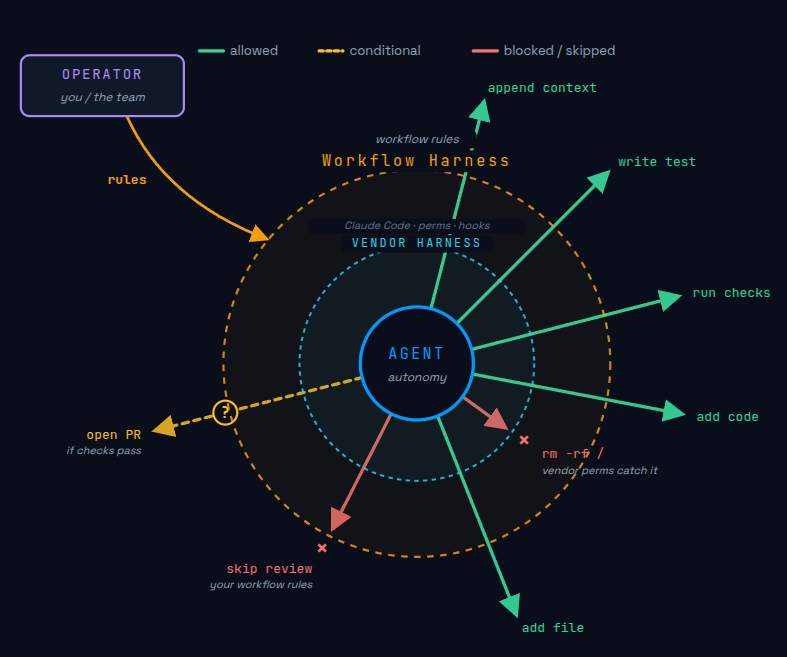
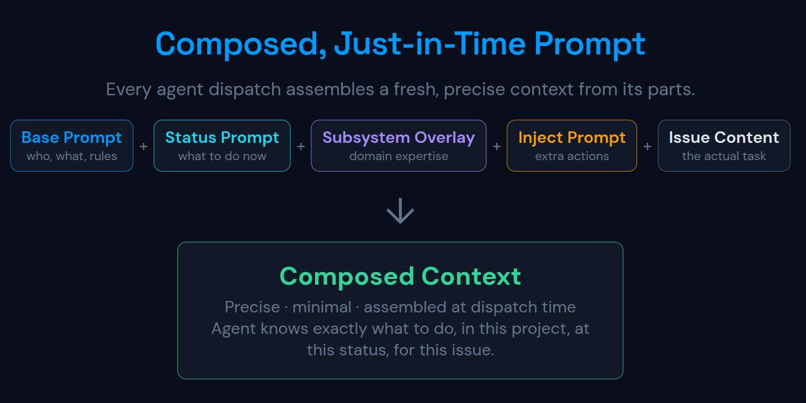

## The problem

AI coding agents are great at writing code and terrible at knowing when to stop, what to verify, and when to hand off to a human. Left alone they'll mark anything "done".

## A contract for agents

A workflow harness gives them a contract:

- A status lifecycle they must walk one step at a time (`idea → in design → backlog → in progress → testing → …`).
- Validation rules at each transition (the body has a Design section, all Test Plan checkboxes are ticked, the linked PR is merged, an arbitrary shell command exits 0).
- Human approval gates at the points that matter (`backlog → in progress`, `shipping → done`).
- Side-effects that happen automatically (clear the assignee on backlog, inject extra prompt context, append a checklist scaffold).
- Per-system overlays, so the API, CLI and UI parts of your project can have their own design prompts and extra rules without forking the whole workflow.

## Vendor harness vs. workflow harness

**Vendor harness → sandbox.** Global rules covering what the agent can and can't do across every project. A lock-in: hooks, skills and the shape of settings are vendor-specific.

**Workflow harness → "what good looks like".** Per project and per kind of work. It refines behaviour, and it's portable: take it with you when you swap vendors. The same workflow runs on both Codex and Claude.

## Just-in-time prompts

Agents don't get a giant system prompt up front. Instead, the harness assembles a prompt **on demand** from pieces that live next to the work:

- The current status's `prompt` from `workflow.yaml` (what to focus on right now).
- The next transition's `Requires:` / `Will:` block (the gates and side-effects ahead).
- Any per-system overlay for the issue's `system` field (API, CLI or UI-specific guidance).
- The issue body, comments, checklists and sidecar data, read fresh from disk.

The agent calls `issue-cli context <slug>` and `issue-cli process` to pull exactly the slice it needs for the step it's on: no stale context, no prompt drift.
